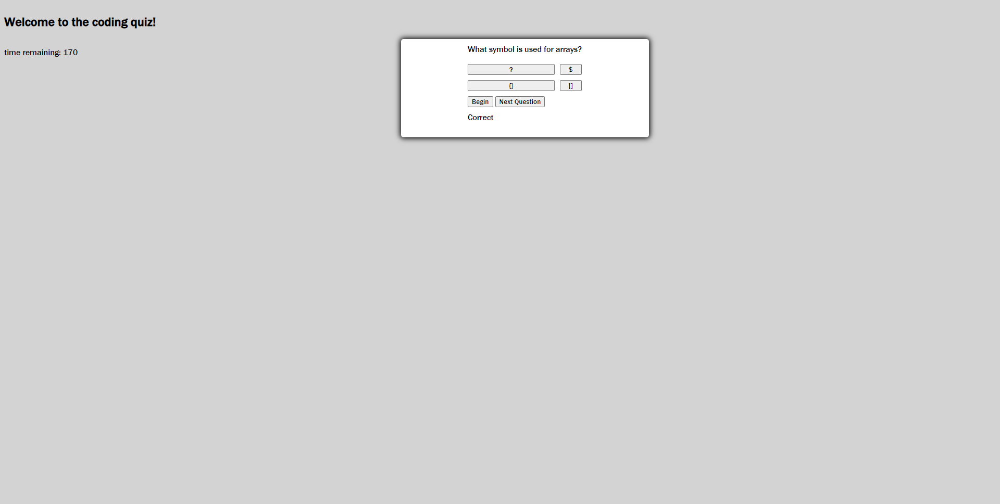

# Coding-Quiz

-- Motivation:  The goal behind this project was to create a timed quiz where a user would have to answer 5 coding related quiz questions.  The final score users receive is not included in this version of the
code.  The intetned goal was to have the users remaining time counted as their score, and to have that score saved in local storage.

-- Usage:  Users will hit the "begin" button to initaite the quiz.  Upon initiation of the quiz users will have 180 seconds to answer 5 coding related questions.  Users will be able to see whether they were correct
or incorrect upon button push.  The intended goal was to have 10 seconds removed for every wrong answer, and have the final time represent the score.  

-- Image of quiz app

